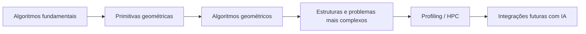
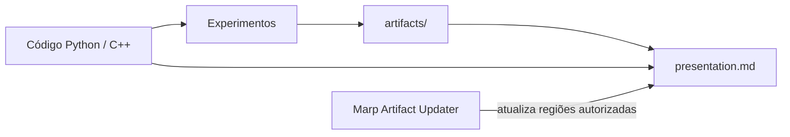
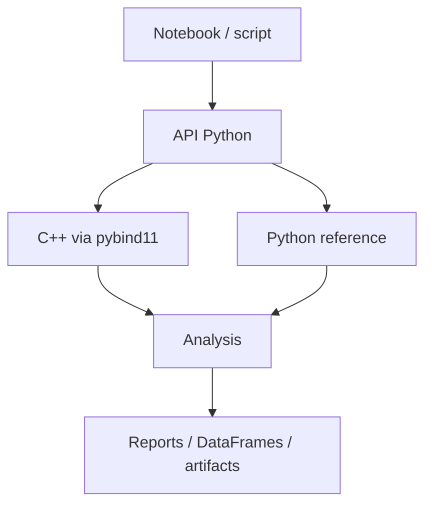
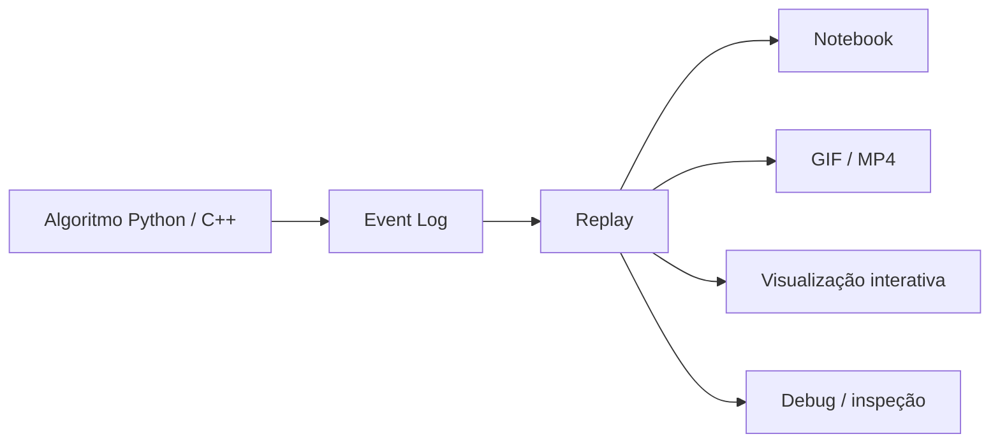
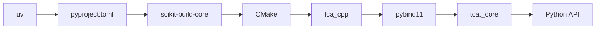
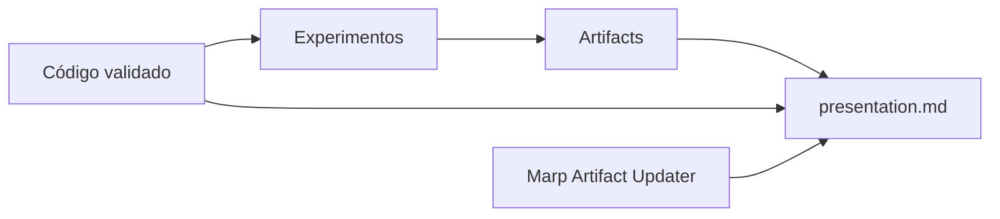
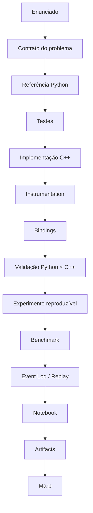

# Projeto TCA — Fundação Arquitetural, Experimental e Operacional

**EES108 — Técnicas Computacionais Avançadas**  
**Geometria Computacional · C++/Python · Instrumentação · Benchmarking · Reprodutibilidade · HPC**

**Documento de fundação do projeto**  
**Versão 1.0 — agosto de 2026**

---

## 1. Propósito

Defino o **TCA** como um projeto acadêmico incremental para a disciplina EES108 — Técnicas Computacionais Avançadas. Seu objetivo não é armazenar respostas isoladas às listas de exercícios, mas utilizar cada atividade da disciplina como um incremento verificável de uma biblioteca computacional coerente.

A evolução esperada parte de algoritmos fundamentais, avança para Geometria Computacional, incorpora análise experimental e, quando pertinente, técnicas de HPC. A introdução de Inteligência Artificial prevista na disciplina será tratada como uma extensão posterior, potencialmente acoplada a problemas geométricos, e não como eixo estrutural do scaffold inicial.

O projeto nasce com quatro preocupações igualmente importantes:

1. **correção algorítmica**;
2. **separação clara entre Python e C++**;
3. **observabilidade da execução**;
4. **reprodutibilidade dos experimentos**.

A primeira lista, centrada em algoritmos de ordenação, será deliberadamente utilizada para validar toda essa infraestrutura em um domínio simples, conhecido e controlável.

> **Princípio central:** cada algoritmo incorporado ao TCA deve poder ser executado, validado, observado, comparado e, quando relevante, reproduzido experimentalmente.

---

## 2. Escopo acadêmico

A disciplina deverá transitar, em diferentes graus de profundidade, por:

- algoritmos fundamentais;
- Geometria Computacional;
- HPC;
- introdução a IA.

O foco principal do projeto será **Geometria Computacional**, porém os algoritmos anteriores a ela serão tratados como componentes reutilizáveis da biblioteca.

A progressão conceitual é:



Exemplos plausíveis de evolução:

```text
sorting
  ↓
predicados geométricos
  ↓
interseções
  ↓
fecho convexo
  ↓
triangulações / mesh
  ↓
otimização / paralelismo
  ↓
integrações futuras
```

Essa sequência não é uma obrigação de conteúdo. A disciplina determinará quais módulos realmente serão implementados.

---

## 3. Relação com o Research OS

O TCA é concebido de maneira compatível com as convenções do **Research OS**, mas será inicialmente um **repositório independente**.

O Research OS fornece contexto organizacional e algumas convenções que adoto no TCA:

- Python 3.12;
- `uv` para ambiente e dependências;
- `pyproject.toml`;
- Ruff;
- Black;
- pytest;
- pre-commit;
- artefatos reproduzíveis;
- separação entre fonte, resultados derivados e apresentações.

Nesta fase:

- o TCA não é submódulo do Research OS;
- não depende do Research OS para executar;
- não possui `.gitmodules`;
- deve ser clonável, compilável e testável isoladamente.

A futura incorporação ao Research OS deverá ser uma decisão logística, não arquitetural.

---

## 4. Relação com o Marp Artifact Updater

O **Marp Artifact Updater** é tratado como ferramenta externa e vizinha ao TCA.

Sua função no projeto é atualizar apresentações Markdown a partir de artefatos produzidos por código, experimentos ou notebooks.



O TCA produz:

- código;
- logs;
- métricas;
- tabelas;
- figuras;
- relatórios;
- animações.

O Marp Artifact Updater apenas consome esses elementos quando necessário à apresentação.

Ele não pertence ao núcleo da biblioteca e não deve ser dependência de runtime do pacote `tca`.

---

## 5. Identidade do projeto

| Elemento | Convenção |
|---|---|
| Pasta local | `ees108_TCA` |
| Repositório Git | `ees108_TCA` |
| Remoto | GitHub privado |
| Pacote Python | `tca` |
| Import | `import tca` |
| Namespace C++ | `tca::` |
| Biblioteca C++ | `tca_cpp` |
| Extensão compilada | `tca._core` |
| Documento de fundação | `docs/FOUNDATION.md` |

A disciplina aparece no nome do repositório, mas não na API.

Exemplos desejados:

```python
from tca.algorithms.sorting import sort
```

```cpp
tca::algorithms::merge_sort(...);
```

---

# Parte I — Arquitetura do software

## 6. Regra de dependência

A arquitetura adota uma direção principal:

```text
notebooks / assignments / apresentações
                ↓
          API Python
                ↓
       bindings pybind11
                ↓
        biblioteca C++
```

O C++ não deve conhecer Python.

O Python conhece o C++.

Os bindings conhecem ambos, mas apenas para adaptação.

---

## 7. C++ como núcleo computacional

O C++ representa a biblioteca algorítmica propriamente dita.

Responsabilidades:

- algoritmos;
- estruturas de dados;
- kernels computacionalmente relevantes;
- primitivas reutilizáveis;
- instrumentação de baixo nível;
- versões seriais e futuras versões paralelas.

O código principal reside em:

```text
cpp/include/tca/
cpp/src/
```

A camada:

```text
cpp/bindings/
```

não deve conter a implementação dos algoritmos.

### Exemplo

```cpp
// cpp/include/tca/algorithms/sorting/insertion_sort.hpp

#pragma once
#include <span>

namespace tca::algorithms {

void insertion_sort(std::span<double> values);

}
```

```cpp
// cpp/src/algorithms/sorting/insertion_sort.cpp

#include "tca/algorithms/sorting/insertion_sort.hpp"

namespace tca::algorithms {

void insertion_sort(std::span<double> values) {
    // implementação
}

}
```

Esse código deve continuar utilizável mesmo que toda a camada Python seja removida.

---

## 8. Python como ingestor científico

Python será a principal interface de uso do projeto.

Ele será responsável por:

- preparar dados;
- gerar datasets experimentais;
- chamar C++;
- expor uma API de alto nível;
- manter implementações de referência;
- executar comparação entre métodos;
- gerar benchmarks;
- analisar resultados;
- construir DataFrames;
- produzir gráficos;
- gerar animações;
- alimentar notebooks e apresentações.

A função do Python é **orquestrar e analisar**, não substituir o núcleo de alto desempenho.



---

## 9. Implementações de referência em Python

Quando academicamente útil, o mesmo algoritmo existirá em Python.

Exemplo:

```text
Python reference
      ↕
   testes
      ↕
C++ implementation
```

A versão Python serve a três finalidades.

### Didática

Permite observar o algoritmo em uma linguagem de maior nível.

### Validação

Pode atuar como oráculo para a implementação C++.

### Comparação experimental

Permite distinguir:

```text
complexidade do algoritmo
        ≠
custo da linguagem / implementação
```

Quando Python e C++ implementarem a mesma variante algorítmica, espera-se que produzam:

- mesma saída;
- mesmos contadores semânticos;
- mesma resposta a casos degenerados.

Não se espera o mesmo tempo de execução.

---

## 10. pybind11 como fronteira

`pybind11` será utilizado para expor a biblioteca C++ ao Python.

Exemplo mínimo:

```cpp
PYBIND11_MODULE(_core, m) {
    m.def(
        "insertion_sort",
        &tca::algorithms::insertion_sort
    );
}
```

O binding não deve decidir:

- qual algoritmo escolher;
- qual benchmark executar;
- como gerar datasets;
- como produzir gráficos;
- como interpretar resultados.

Essas responsabilidades pertencem ao Python.

---

## 11. NumPy como contrato numérico principal

Na fronteira Python/C++, arrays numéricos deverão utilizar preferencialmente NumPy.

Para sorting, o contrato inicial será:

```text
dtype: float64
shape: (n,)
layout: C-contiguous
```

Para GC, a representação poderá evoluir naturalmente para:

```text
points.shape == (n, 2)
points.dtype == float64
```

A API Python poderá aceitar entradas flexíveis, mas deverá convertê-las antes de chamar o núcleo.

Em benchmarks, qualquer conversão deve ocorrer **fora da região cronometrada**.

---

# Parte II — Instrumentação e observabilidade

## 12. Instrumentation e benchmark não são a mesma coisa

O projeto estabelece uma distinção rígida.

### Instrumentation

Pergunta:

> **Como o algoritmo executou?**

Pode registrar:

- comparações;
- swaps;
- escritas;
- chamadas;
- recursão;
- árvore de chamadas;
- eventos;
- tempo interno por escopo;
- memória auxiliar lógica.

### Benchmark

Pergunta:

> **Quanto a implementação custou em condições controladas?**

Pode registrar:

- wall-clock time;
- peak RAM;
- throughput;
- distribuição de tempos;
- speedup;
- eficiência.

A instrumentação possui overhead.

Assim:

> **tempo instrumentado não é benchmark oficial**.

O benchmark deve usar a implementação com instrumentação lógica desativada.

---

## 13. Produtos formais da instrumentação

A instrumentação terá três produtos complementares:

```text
Instrumentation
├── Metrics
├── Call Trace
└── Event Log
```

### Metrics

Resumo quantitativo.

Exemplo:

```text
comparisons
writes
swaps
function_calls
max_recursion_depth
auxiliary_bytes_peak
```

### Call Trace

Representa a estrutura da execução.

Exemplo:

```text
merge_sort
├── merge_sort
│   ├── merge_sort
│   └── merge_sort
└── merge_sort
```

Pode incluir tempos inclusivos e exclusivos.

### Event Log

Representa a sequência semântica completa de transformações relevantes do algoritmo.

Sua propriedade fundamental é:

> **deve ser possível reconstruir visualmente a execução a partir do Event Log sem reexecutar o algoritmo.**

---

## 14. Modos de instrumentação

A API deverá admitir níveis distintos:

```text
off
summary
call_trace
events
full
```

### `off`

Usado em benchmarks.

### `summary`

Somente métricas agregadas.

### `call_trace`

Métricas + scopes/chamadas.

### `events`

Métricas + eventos necessários para replay.

### `full`

Tudo que estiver habilitado.

O volume esperado cresce aproximadamente assim:

```text
off          |
summary      |█
call_trace   |███
events       |██████
full         |████████
```

---

## 15. Instrumentação sem duplicar algoritmos

Não devem existir duas implementações do mesmo algoritmo:

```text
merge_sort.cpp
merge_sort_instrumented.cpp
```

A mesma lógica deve ser executada com diferentes políticas de observação.

### Conceito

```cpp
template <class Probe>
void insertion_sort_impl(std::span<double> values, Probe& probe) {
    tca::instrument::Scope scope{probe, "insertion_sort"};

    for (std::size_t i = 1; i < values.size(); ++i) {
        double key = values[i];
        std::size_t j = i;

        while (j > 0) {
            probe.comparison();

            if (!(key < values[j - 1])) {
                break;
            }

            values[j] = values[j - 1];
            probe.write();
            --j;
        }

        values[j] = key;
        probe.write();
    }
}
```

Execução normal:

```cpp
NullProbe probe;
insertion_sort_impl(values, probe);
```

Execução instrumentada:

```cpp
MetricsProbe probe;
insertion_sort_impl(values, probe);
```

O `NullProbe` deve ser trivial e otimizado pelo compilador.

---

## 16. RAII e escopos

A árvore de chamadas será instrumentada com RAII.

```cpp
void merge_sort(...) {
    Scope scope{probe, "merge_sort"};
    ...
}
```

O construtor registra entrada.

O destrutor registra saída.

Isso torna recursão naturalmente rastreável e protege o estado mesmo diante de `return`.

Um relatório pode obter:

```text
calls
max_depth
inclusive_time
exclusive_time
```

---

## 17. Inclusive time e exclusive time

Considere:

```text
A = 10 ms
├── B = 4 ms
└── C = 3 ms
```

Então:

```text
A inclusive = 10 ms
A exclusive = 3 ms
```

O inclusive time contém os filhos.

O exclusive time representa apenas o custo interno daquele escopo observado.

Isso será particularmente útil em GC, quando algoritmos de alto nível chamarem primitivas fundamentais milhares de vezes.

---

## 18. Contadores semânticos

Não será utilizada uma métrica universal chamada apenas `operations`.

Em vez disso, cada domínio define operações semanticamente relevantes.

### Sorting

Inicialmente:

| Métrica | Definição |
|---|---|
| `comparisons` | comparação lógica entre chaves |
| `swaps` | troca explícita de dois elementos |
| `writes` | escrita lógica em vetor ou buffer |
| `function_calls` | scopes observados |
| `max_recursion_depth` | maior profundidade |
| `auxiliary_bytes_current` | memória auxiliar lógica corrente |
| `auxiliary_bytes_peak` | pico de memória auxiliar lógica |

### GC futuramente

Exemplos:

```text
orientation_tests
segment_intersections
distance_evaluations
point_insertions
edge_flips
triangle_quality_evaluations
```

---

## 19. Convenção de comparação

Uma comparação é contabilizada quando duas chaves são comparadas para decidir o comportamento do algoritmo.

Exemplo:

```cpp
probe.comparison();

if (values[j] < pivot) {
    ...
}
```

Não são contadas:

- comparações de índices de loop;
- verificações internas da instrumentação;
- checks administrativos;
- instruções de máquina.

A métrica é **algorítmica**, não microarquitetural.

---

## 20. Convenção de escrita

`writes` representa modificação lógica dos dados manipulados.

Isso é importante porque algoritmos diferentes movem dados de formas diferentes.

Insertion sort, por exemplo, pode deslocar elementos sem realizar swaps explícitos.

Assim:

```text
writes ≠ 2 × swaps
```

necessariamente.

A mesma definição deve ser usada no Python e no C++.

---

## 21. Instrumentação Python equivalente

A implementação de referência usará o mesmo vocabulário.

```python
def insertion_sort(values, probe):
    with probe.scope("insertion_sort"):
        for i in range(1, len(values)):
            key = values[i]
            j = i

            while j > 0:
                probe.comparison()

                if not key < values[j - 1]:
                    break

                values[j] = values[j - 1]
                probe.write()
                j -= 1

            values[j] = key
            probe.write()
```

Não interessa contar bytecodes Python.

Interessa contar operações algorítmicas equivalentes.

---

# Parte III — Event Log e animação

## 22. Event Log semântico

O Event Log não registrará linhas de código executadas.

Ele registrará eventos do algoritmo.

### Eventos universais

```text
run_start
run_end
scope_enter
scope_exit
compare
write
swap
```

### Sorting

Exemplos:

```text
select
split
merge_begin
merge_end
pivot
partition
```

### GC futuramente

Exemplos:

```text
orientation_test
candidate_point
accept_point
reject_point
segment_intersection
edge_selected
edge_flip
```

---

## 23. JSON Lines como formato preferencial

O formato inicial recomendado é:

```text
*.events.jsonl
```

Cada linha representa um evento.

Exemplo:

```json
{"event_id":1,"type":"select","index":1,"value":2}
{"event_id":2,"type":"compare","i":0,"j":1}
{"event_id":3,"type":"write","index":1,"value":5}
{"event_id":4,"type":"write","index":0,"value":2}
```

Vantagens:

- streaming;
- fácil leitura incremental;
- não exige carregar todo o arquivo;
- simples de depurar;
- simples de converter em DataFrame;
- apropriado para replay.

---

## 24. Event sourcing

O estado completo não deve ser repetido em todos os eventos.

O log começa com:

```json
{"type":"initial_state","values":[8,2,6,1,5,3,7,4]}
```

e depois registra apenas transformações:

```json
{"type":"swap","i":0,"j":1}
```

A visualização reconstrói:

\[
S_{t+1}=f(S_t,e_t)
\]

Isso reduz significativamente o volume de dados.

---

## 25. IDs de eventos e scopes

Cada evento deverá possuir um `event_id`.

Scopes podem possuir:

```text
scope_id
parent_scope_id
depth
```

Exemplo:

```json
{
  "event_id": 314,
  "type": "scope_enter",
  "scope_id": 17,
  "parent_scope_id": 5,
  "name": "merge_sort",
  "depth": 3
}
```

Essa identificação permite reconstruir recursão e call trees.

O `event_id` representa ordem lógica.

Timestamp é informação adicional, não substituto da ordem lógica.

---

## 26. Animação desacoplada do algoritmo

A animação será construída por um módulo independente:

```text
src/tca/visualization/
├── replay.py
├── sorting.py
├── geometry.py
└── mesh.py
```

O visualizador recebe:

```text
initial state + event log
```

e não chama novamente o algoritmo.

Fluxo:



Uma mesma infraestrutura de replay poderá animar Python ou C++.

---

## 27. Snapshots opcionais

Para logs muito grandes, poderão existir snapshots periódicos.

Exemplo:

```text
event 0       snapshot
event 1000    snapshot
event 2000    snapshot
```

Isso permite acesso mais rápido a um ponto distante da execução.

Não é requisito inicial da Lista 1.

---

# Parte IV — Memória e tempo

## 28. Três noções de memória

A análise distingue:

1. memória auxiliar lógica;
2. memória residente do processo;
3. alocações internas C++.

### Memória auxiliar lógica

Relacionada à formulação algorítmica.

Exemplo:

```text
merge buffer = n × sizeof(T)
```

Pode ser rastreada deterministicamente.

### Memória do processo

Representa a memória efetivamente observada pelo sistema operacional.

Inclui:

- Python;
- bibliotecas;
- NumPy;
- C++;
- allocator;
- binding;
- demais componentes.

### Alocações internas C++

Poderão ser rastreadas futuramente com allocators instrumentados ou `std::pmr`.

Não serão requisito inicial.

---

## 29. Benchmarking temporal

A métrica oficial inicial será o **wall-clock time observado pela API Python**.

Assim, para backend C++:

```text
Python call
  ↓
binding
  ↓
C++
  ↓
binding
  ↓
Python return
```

O custo observado inclui o overhead real de uso do backend.

Kernel time C++ poderá ser registrado separadamente para diagnóstico.

---

## 30. Região cronometrada

A preparação do dataset deve ocorrer fora do timer.

Correto:

```text
gerar dataset
      ↓
preparar cópia
      ↓
START
      ↓
algoritmo
      ↓
STOP
      ↓
validar
```

A cópia pode ser medida separadamente, mas não deve contaminar o tempo oficial do algoritmo.

---

## 31. Build de benchmark

Benchmarks oficiais de C++ devem utilizar build otimizado.

Os resultados precisam registrar:

```text
build_type = Release
```

Resultados produzidos em `Debug` não devem ser comparados com resultados oficiais de performance.

---

# Parte V — Reprodutibilidade experimental

## 32. Reprodutibilidade como requisito

Todo experimento formal do TCA deve ser reconstruível a partir de:

- commit do projeto;
- arquivo de configuração;
- master seed;
- algoritmo de geração;
- versões relevantes do ambiente.

A regra desejada é:

> **o notebook não é a fonte da geração do experimento; ele é consumidor de uma especificação experimental reproduzível.**

---

## 33. Três níveis de reprodutibilidade

### Dataset

Deve ser possível reconstruir exatamente a entrada.

### Instrumentation

Dado algoritmo determinístico e dataset idêntico, os contadores e eventos devem ser reproduzíveis.

### Benchmark

O dataset e o protocolo devem ser reproduzíveis, mas o tempo físico naturalmente apresenta ruído. Por isso utiliza repetições e estatística.

---

## 34. Experiment ID, Dataset ID e Run ID

Três identificadores distintos serão usados.

### Experiment ID

Exemplo:

```text
sorting-metrics-v1
```

### Dataset ID

Exemplo:

```text
sorting/n=10000/nearly_sorted/rep=017
```

### Run ID

Exemplo:

```text
merge/cpp/run=004
```

Isso evita ambiguidade entre dados e repetição temporal.

---

## 35. `k` replicates e `r` benchmark runs

A notação será formal.

### `k`

Número de **datasets distintos** para a mesma família e tamanho.

Exemplo:

```text
uniform/rep=0
uniform/rep=1
...
uniform/rep=k-1
```

### `r`

Número de execuções temporais do **mesmo dataset**.

Exemplo:

```text
uniform/rep=7/run=0
uniform/rep=7/run=1
...
uniform/rep=7/run=r-1
```

Assim:

\[
k = \text{replicações da entrada}
\]

e:

\[
r = \text{repetições temporais}
\]

Para Metrics, normalmente uma execução por dataset é suficiente.

Para tempo, são necessárias múltiplas execuções.

---

## 36. Master seed

Cada experimento possui uma:

```text
master_seed
```

Exemplo:

```yaml
experiment:
  id: sorting-metrics-v1
  master_seed: 1082026
```

Nenhum notebook deverá depender de:

```python
np.random.seed(...)
```

espalhado por células.

---

## 37. Seeds derivadas por identidade

Cada dataset receberá uma seed derivada deterministicamente de:

```text
master_seed
experiment
n
case
replicate
```

Conceitualmente:

```python
seed = derive_seed(
    master_seed,
    experiment="sorting",
    n=1000,
    case="uniform",
    replicate=3,
)
```

Essa seed não deve depender da ordem de execução dos experimentos.

Adicionar um novo caso não poderá alterar as seeds dos casos antigos.

A derivação deve usar uma função estável e explicitamente definida.

---

## 38. PRNG explícito

A configuração deve registrar o gerador utilizado.

Exemplo:

```yaml
rng:
  library: numpy
  bit_generator: PCG64
```

A implementação deverá instanciar explicitamente o gerador.

Exemplo:

```python
rng = np.random.Generator(
    np.random.PCG64(seed)
)
```

O objetivo é evitar dependência silenciosa de defaults futuros.

---

# Parte VI — Famílias de entrada para sorting

## 39. Matriz de casos

Para cada tamanho `n`, serão gerados `k` datasets de cada uma das seguintes famílias:

1. aleatório uniforme;
2. já ordenado;
3. ordem reversa;
4. quase ordenado;
5. quase ordenado reverso;
6. muitos valores repetidos;
7. todos os valores iguais.

Assim, para cada `n`:

\[
N_{\text{datasets}} = 7k
\]

Todos os métodos e backends recebem exatamente as mesmas instâncias.

---

## 40. Uniforme

Definição inicial:

\[
x_i \sim U(0,1)
\]

com:

```text
dtype = float64
```

Exemplo:

```python
x = rng.random(n, dtype=np.float64)
```

Esse vetor pode atuar como base para as famílias relacionadas à ordenação inicial.

---

## 41. Já ordenado

Para o mesmo replicate:

```python
base = uniform(...)
x = np.sort(base)
```

A família `sorted` compartilha o mesmo multiconjunto da base uniforme correspondente.

---

## 42. Ordem reversa

Também deriva da mesma base:

```python
x = np.sort(base)[::-1].copy()
```

Assim:

```text
uniform
sorted
reverse
```

possuem exatamente os mesmos valores, em ordens distintas.

Isso melhora a comparação experimental.

---

## 43. Quase ordenado

“Quase ordenado” deve possuir uma definição operacional explícita.

Parâmetro inicial:

```yaml
perturbation_fraction: 0.05
perturbation: adjacent_swap
```

Partimos do vetor ordenado e selecionamos deterministicamente posições para trocas adjacentes.

Se:

\[
m = \operatorname{round}(p(n-1))
\]

então são realizadas `m` perturbações.

Exemplo conceitual:

```python
indices = rng.choice(
    n - 1,
    size=m,
    replace=False,
)

for i in indices:
    x[i], x[i + 1] = x[i + 1], x[i]
```

O parâmetro `p` fica registrado e pode ser estudado posteriormente.

---

## 44. Quase ordenado reverso

É a construção simétrica.

Parte-se do vetor reversamente ordenado e aplica-se a mesma política de perturbação.

Quando possível, utiliza-se o mesmo conjunto de posições do `nearly_sorted` correspondente.

---

## 45. Muitos valores repetidos

A definição inicial utiliza uma cardinalidade controlada.

Exemplo:

```yaml
many_duplicates:
  cardinality: 8
```

Então:

\[
x_i \in \{0,\dots,7\}
\]

Exemplo:

```python
x = rng.integers(
    0,
    8,
    size=n,
).astype(np.float64)
```

A cardinalidade é parte explícita da configuração.

---

## 46. Todos os valores iguais

Definição:

\[
x_i = c
\]

para todo `i`.

O valor `c` poderá ser derivado da seed do dataset:

```python
value = rng.random()
x = np.full(n, value, dtype=np.float64)
```

---

## 47. Dataset seed e algorithm seed

O projeto separará:

```text
dataset_seed
algorithm_seed
```

A primeira controla a entrada.

A segunda controla decisões internas de algoritmos randomizados.

Essa separação será necessária, por exemplo, se uma variante de quicksort escolher pivô aleatoriamente.

Assim, um mesmo dataset poderá ser executado com diferentes decisões algorítmicas sem regenerar a entrada.

---

## 48. Manifest e hash

Cada dataset deverá possuir metadados suficientes para auditoria.

Exemplo:

```json
{
  "dataset_id": "sorting/n=1000/nearly_sorted/rep=03",
  "n": 1000,
  "case": "nearly_sorted",
  "replicate": 3,
  "seed": 9176238123312,
  "dtype": "float64",
  "generator": {
    "base": "uniform",
    "perturbation": "adjacent_swap",
    "perturbation_fraction": 0.05
  },
  "sha256": "..."
}
```

O hash poderá ser calculado sobre a representação binária canônica do array.

A função do hash é verificar se a reconstrução gerou exatamente o mesmo dataset.

---

## 49. Arrays não precisam ser versionados

Datasets sintéticos grandes são derivados.

Assim, em geral, o Git deve versionar:

```text
config
generator code
manifest
hashes
```

e não milhares de arquivos `.npy`.

Datasets pequenos de testes podem ser versionados quando útil.

---

# Parte VII — Especificação dos experimentos

## 50. Arquivo de configuração

Experimentos formais devem ser configurados por arquivo.

Exemplo:

```yaml
experiment:
  id: sorting-metrics-v1
  master_seed: 1082026

sizes:
  - 10
  - 100
  - 1000
  - 10000

replicates: 30

cases:
  uniform: {}

  sorted:
    source: uniform

  reverse:
    source: uniform

  nearly_sorted:
    source: sorted
    perturbation_fraction: 0.05
    perturbation: adjacent_swap

  nearly_reverse:
    source: reverse
    perturbation_fraction: 0.05
    perturbation: adjacent_swap

  many_duplicates:
    cardinality: 8

  all_equal: {}

rng:
  library: numpy
  bit_generator: PCG64

dtype: float64
```

---

## 51. Runner

O experimento deve ser executável por script ou módulo.

Conceitualmente:

```bash
uv run python -m tca.analysis.run benchmarks/configs/sorting_metrics_v1.yaml
```

O notebook não deve ser necessário para produzir os resultados.

---

## 52. Matriz experimental

Para cada combinação:

```text
n
case
replicate
algorithm
backend
```

é executada a medição de Metrics.

Para tempo:

```text
n
case
replicate
algorithm
backend
run
```

O resultado bruto pode ser representado tabularmente:

| n | case | rep | method | backend | run | comparisons | writes | swaps | time_ns |
|---:|---|---:|---|---|---:|---:|---:|---:|---:|
| 1000 | uniform | 0 | merge | cpp | 0 | ... | ... | ... | ... |

---

## 53. Estatística de benchmark

O benchmark deve armazenar os valores brutos.

Resumos podem incluir:

- mínimo;
- mediana;
- média;
- desvio-padrão;
- Q1;
- Q3;
- IQR;
- número de execuções.

A mediana será o valor central preferencial para comparação visual.

---

## 54. Complexidade experimental

A infraestrutura deve permitir comparar métricas observadas contra funções de crescimento.

Exemplo:

```python
study = complexity_study(
    method="merge",
    backend="cpp",
    sizes=[100, 300, 1000, 3000, 10000],
    metric="comparisons",
)
```

Referências:

```text
n
n log n
n²
```

Isso permite observar três camadas distintas:

```text
complexidade teórica
        ↓
operações algorítmicas medidas
        ↓
tempo real
```

Essa separação será especialmente valiosa na disciplina.

---

# Parte VIII — Primeira lista: sorting

## 55. Sorting como primeiro milestone completo

A Lista 1 será utilizada para validar:

- pacote Python;
- compilação C++;
- bindings;
- API pública;
- implementações de referência;
- instrumentação;
- recursão;
- event log;
- animação;
- benchmark;
- RAM;
- datasets reproduzíveis;
- geração de artifacts;
- apresentação Marp.

Os algoritmos exatos serão definidos pelo enunciado da disciplina.

O scaffold deverá acomodar naturalmente métodos como:

```text
insertion sort
merge sort
quicksort
heap sort
...
```

Sem implementar algoritmos extras apenas para preencher a arquitetura.

---

## 56. API de sorting

Exemplo desejado:

```python
from tca.algorithms.sorting import sort

result = sort(
    values,
    method="merge",
    backend="cpp",
)
```

Backend Python:

```python
result = sort(
    values,
    method="merge",
    backend="python",
)
```

---

## 57. Instrumentação de sorting

Exemplo:

```python
from tca.analysis import trace_sort

report = trace_sort(
    values,
    method="merge",
    backend="cpp",
    level="summary",
)
```

Event Log:

```python
report = trace_sort(
    values,
    method="merge",
    backend="cpp",
    level="events",
)
```

Salvar:

```python
report.events.to_jsonl(
    "artifacts/merge.events.jsonl"
)
```

---

## 58. Replay e animação

Exemplo conceitual:

```python
from tca.visualization.sorting import animate

animate(
    "artifacts/merge.events.jsonl",
    output="artifacts/merge.gif",
)
```

A animação é derivada do log.

Ela não executa novamente `merge_sort`.

---

## 59. Validação Python × C++

A saída deve ser comparada.

```python
assert np.array_equal(
    sort(x, method="merge", backend="python"),
    sort(x, method="merge", backend="cpp"),
)
```

Os contadores também podem ser comparados:

```python
assert py_report.comparisons == cpp_report.comparisons
assert py_report.writes == cpp_report.writes
```

Isso utiliza a instrumentação também como ferramenta de teste.

---

# Parte IX — Estrutura do repositório

## 60. Scaffold proposto

```text
ees108_TCA/
│
├── .gitignore
├── .python-version
├── .pre-commit-config.yaml
├── CMakeLists.txt
├── pyproject.toml
├── README.md
├── uv.lock
│
├── docs/
│   ├── FOUNDATION.md
│   └── algorithms/
│
├── cpp/
│   ├── include/
│   │   └── tca/
│   │       ├── core/
│   │       │   └── instrumentation/
│   │       │       ├── counters.hpp
│   │       │       ├── scope.hpp
│   │       │       ├── event.hpp
│   │       │       ├── event_sink.hpp
│   │       │       ├── null_probe.hpp
│   │       │       └── metrics_probe.hpp
│   │       │
│   │       └── algorithms/
│   │           └── sorting/
│   │
│   ├── src/
│   │   ├── core/
│   │   └── algorithms/
│   │       └── sorting/
│   │
│   └── bindings/
│       ├── module.cpp
│       ├── sorting.cpp
│       └── instrumentation.cpp
│
├── src/
│   └── tca/
│       ├── __init__.py
│       │
│       ├── algorithms/
│       │   └── sorting/
│       │
│       ├── reference/
│       │   └── sorting/
│       │
│       ├── analysis/
│       │   ├── benchmark.py
│       │   ├── complexity.py
│       │   ├── datasets.py
│       │   ├── experiments.py
│       │   ├── memory.py
│       │   ├── report.py
│       │   ├── reproducibility.py
│       │   └── tracing.py
│       │
│       └── visualization/
│           ├── replay.py
│           └── sorting.py
│
├── assignments/
│   └── 01-sorting/
│       ├── README.md
│       ├── solution.ipynb
│       ├── presentation.md
│       └── artifacts/
│
├── benchmarks/
│   ├── configs/
│   ├── manifests/
│   ├── results/
│   └── scripts/
│
├── notebooks/
│   ├── demos/
│   └── exploratory/
│
├── tests/
│   ├── cpp/
│   ├── python/
│   ├── integration/
│   └── data/
│
└── scripts/
```

Nem todos os diretórios precisam nascer vazios. O scaffold deve crescer organicamente.

---

## 61. Responsabilidades por diretório

### `cpp/include/tca/`

Componentes reutilizáveis e API C++.

### `cpp/src/`

Implementações compiladas.

### `cpp/bindings/`

Adaptação pybind11.

### `src/tca/algorithms/`

API Python pública.

### `src/tca/reference/`

Implementações didáticas/de referência.

### `src/tca/analysis/`

Experimentos, métricas, benchmarking e reprodutibilidade.

### `src/tca/visualization/`

Replay e visualização de Event Logs.

### `assignments/`

Material específico das listas.

### `benchmarks/`

Configuração e resultados experimentais.

### `docs/`

Documentação durável.

---

# Parte X — Toolchain e build

## 62. Python

Baseline:

```text
Python 3.12
uv
NumPy
Pandas
Matplotlib
Jupyter
pytest
Ruff
Black
pre-commit
```

---

## 63. C++

Baseline:

```text
C++20
CMake
MSVC no Windows
pybind11
scikit-build-core
clang-format
```

O compilador poderá mudar futuramente, mas o projeto não deve depender de extensões específicas do MSVC.

---

## 64. Build

Fluxo:



Uso normal:

```bash
uv sync
uv run pytest
```

CMake permanece explícito, porém não deve exigir execução manual no fluxo cotidiano.

---

## 65. Configuração Python conceitual

```toml
[build-system]
requires = [
    "scikit-build-core",
    "pybind11",
]
build-backend = "scikit_build_core.build"

[project]
name = "tca"
version = "0.1.0"
requires-python = ">=3.12,<3.13"

dependencies = [
    "matplotlib",
    "numpy",
    "pandas",
]

[dependency-groups]
dev = [
    "black",
    "ipykernel",
    "jupyterlab",
    "pre-commit",
    "pytest",
    "ruff",
]
```

Bibliotecas adicionais serão introduzidas apenas quando necessárias.

---

# Parte XI — Testes e qualidade

## 66. Testes C++

Devem validar o núcleo independentemente de Python.

Inicialmente podem usar CTest e executáveis pequenos.

Testes relevantes:

- vetor vazio;
- um elemento;
- duplicatas;
- ordenado;
- reverso;
- dados aleatórios;
- equivalência `NullProbe` × `MetricsProbe`;
- escopos;
- recursão;
- contadores;
- Event Log.

---

## 67. Testes Python

pytest deverá cobrir:

- API;
- geradores;
- seeds;
- manifests;
- reports;
- visualização;
- implementação de referência.

---

## 68. Testes de integração

Devem validar:

```text
NumPy
  ↓
Python API
  ↓
pybind11
  ↓
C++
  ↓
resultado
```

Também deverão comparar instrumentação Python/C++ quando aplicável.

---

## 69. Testes de reprodutibilidade

Exemplos obrigatórios:

1. mesma configuração + mesma seed → mesmo array;
2. mesma identidade de dataset → mesma seed derivada;
3. alteração da ordem de geração → não altera datasets;
4. hash reconstruído = hash registrado;
5. mesma entrada determinística → mesmos Metrics;
6. Event Log reproduz o mesmo estado final.

---

## 70. Pre-commit

Antes de commit:

```text
Ruff
Black
clang-format
pytest rápido
integração smoke
```

Benchmarks grandes não devem bloquear commits.

Antes de milestones:

```text
build completo
CTest
pytest completo
smoke benchmark
validação de artifacts
```

---

# Parte XII — Notebooks, artifacts e apresentação

## 71. Notebook da Lista 1

Estrutura sugerida:

```text
1. objetivo
2. algoritmos
3. datasets reproduzíveis
4. execução Python
5. execução C++
6. validação
7. Metrics
8. call trace
9. replay / animação
10. estudo de complexidade
11. benchmark temporal
12. benchmark de RAM
13. análise
14. conclusões
```

O notebook não contém a implementação autoritativa.

---

## 72. Artifacts

Exemplos:

```text
assignments/01-sorting/artifacts/
├── benchmark_raw.csv
├── benchmark_summary.csv
├── metrics.csv
├── datasets_manifest.jsonl
├── merge.events.jsonl
├── insertion.events.jsonl
├── merge.gif
├── insertion.gif
├── complexity_comparisons.svg
├── complexity_time.svg
└── memory_peak.svg
```

Artifacts relevantes à entrega podem ser versionados.

---

## 73. Marp

`presentation.md` deve consumir resultados reais.



Isso reduz divergência entre código, análise e apresentação.

---

# Parte XIII — Evolução futura

## 74. Geometria Computacional

A instrumentação criada para sorting deverá ser reutilizável.

Por exemplo:

```text
convex_hull
├── sorting
├── orientation × N
├── push × M
└── pop × K
```

O Event Log poderá alimentar uma animação do fecho sendo construído.

---

## 75. HPC

Quando paralelismo for introduzido:

```text
Python reference
C++ serial
C++ otimizado
C++ paralelo
```

poderão ser comparados.

A instrumentação paralela deverá evitar contadores globais concorrentes.

Modelo futuro:

```text
thread-local metrics
        ↓
reduction
        ↓
report
```

---

## 76. IA

IA não será dependência estrutural inicial.

Quando utilizada, deverá consumir estruturas e operações da biblioteca.

Exemplo futuro:

```text
estado geométrico
      ↓
métricas
      ↓
modelo / política
      ↓
operação
      ↓
novo estado
```

Métodos tradicionais deverão poder competir com métodos aprendidos.

---

# Parte XIV — Decisões do projeto

## 77. Decisões congeladas

Considero definidas:

- `ees108_TCA` como repositório;
- remoto privado;
- independência inicial do Research OS;
- pacote `tca`;
- Python 3.12;
- `uv`;
- C++20;
- CMake;
- scikit-build-core;
- pybind11;
- NumPy como fronteira numérica;
- C++ como núcleo;
- Python como ingestor científico;
- implementações Python de referência;
- instrumentação como capacidade estrutural;
- Metrics, Call Trace e Event Log;
- benchmark separado de instrumentação;
- replay independente do algoritmo;
- reprodutibilidade baseada em config + seeds + manifest + hash;
- `k` para replicações de dados;
- `r` para repetições temporais;
- testes em C++, Python e integração;
- notebooks como consumidores;
- Markdown/Marp como mecanismo de apresentação;
- Marp Artifact Updater como ferramenta externa;
- Ruff, Black, pytest e pre-commit;
- clang-format;
- GitHub Desktop suficiente para publicação do remoto.

---

## 78. Decisões adiadas

Não serão antecipadas sem necessidade:

- OpenMP versus MPI;
- CUDA;
- CGAL;
- Eigen;
- framework C++ de testes;
- estrutura definitiva de `Mesh`;
- triangulação específica;
- allocator instrumentado;
- formato definitivo de profiling paralelo;
- formato definitivo de animação interativa;
- PyTorch/TensorFlow;
- arquitetura de IA;
- projeto final;
- incorporação ao Research OS;
- CI/CD avançado.

---

# Parte XV — Milestones

## 79. Milestone 0 — Scaffold

Concluído quando:

- repositório existe;
- Python 3.12 está configurado;
- `uv sync` funciona;
- C++ compila;
- binding mínimo importa;
- pytest funciona;
- `docs/FOUNDATION.md` está versionado;
- remoto privado existe.

---

## 80. Milestone 1 — Sorting Core

Concluído quando:

- métodos da primeira lista estão implementados;
- Python e C++ são comparáveis;
- API unificada existe;
- instrumentação funciona;
- recursão é rastreável;
- Metrics são coerentes;
- Event Log é gerado;
- replay reproduz a execução.

---

## 81. Milestone 2 — Sorting Experiments

Concluído quando:

- geradores são reproduzíveis;
- sete famílias de entrada estão formalizadas;
- seeds são derivadas;
- manifests e hashes existem;
- `k` replicates são executados;
- benchmark com `r` runs funciona;
- tempo e RAM são registrados;
- dados brutos são preservados;
- estudos de complexidade são gerados.

---

## 82. Milestone 3 — Entrega da Lista 1

Concluído quando:

- notebook está consistente;
- artifacts foram gerados;
- animações relevantes existem;
- apresentação Marp consome resultados reais;
- testes passam;
- experimento pode ser reexecutado a partir da configuração.

---

# Parte XVI — Definition of Done

## 83. Algoritmo

Um algoritmo pode ser considerado incorporado quando, conforme sua importância:

- possui implementação;
- passa nos testes;
- possui API pública;
- possui referência ou oráculo;
- trata casos degenerados;
- pode rodar sem instrumentation;
- pode produzir Metrics;
- pode produzir Event Log quando relevante;
- pode ser benchmarkado;
- possui documentação proporcional.

---

## 84. Experimento

Um experimento é considerado reprodutível quando:

- possui ID;
- possui config versionada;
- possui master seed;
- seeds derivadas são determinísticas;
- PRNG é explícito;
- datasets possuem IDs;
- gerador é versionado;
- hashes podem verificar reconstrução;
- resultados brutos preservam IDs e parâmetros;
- ambiente relevante é registrado;
- execução independe de notebook.

---

# Parte XVII — Fluxo de trabalho

## 85. Fluxo de uma lista



---

# Apêndice A — README inicial

O seguinte conteúdo é adequado como `README.md` inicial.

---

## `README.md`

```markdown
# ees108_TCA

Projeto da disciplina **EES108 — Técnicas Computacionais Avançadas**.

O repositório é desenvolvido incrementalmente a partir das listas da disciplina,
com foco principal em **Geometria Computacional** e posterior extensão para
**HPC**.

## Arquitetura

- C++20: núcleo algorítmico;
- Python 3.12: interface científica;
- pybind11: interoperabilidade Python/C++;
- CMake + scikit-build-core: build;
- uv: ambiente e dependências;
- NumPy/Pandas/Matplotlib: análise;
- pytest: testes;
- instrumentação própria: Metrics, Call Trace e Event Log;
- benchmarking separado: tempo e memória;
- Jupyter: exploração e análise;
- Markdown/Marp: apresentações.

Python funciona como ingestor científico do núcleo C++: prepara dados, chama
implementações, compara métodos, produz relatórios, visualizações e artifacts.

## Filosofia

As listas não são projetos separados.

Cada atividade amplia uma biblioteca comum:

fundamentos → Geometria Computacional → HPC → integrações futuras.

## Instrumentation

A instrumentação responde **como o algoritmo executou**.

Ela pode registrar:

- comparações;
- swaps;
- escritas;
- chamadas;
- profundidade de recursão;
- Call Trace;
- Event Log;
- memória auxiliar lógica.

O Event Log pode ser usado para reproduzir e animar a execução sem chamar
novamente o algoritmo.

## Benchmark

Benchmarking é separado da instrumentação.

Os benchmarks são executados com instrumentation desativada e medem
principalmente:

- wall-clock time;
- memória de processo;
- distribuição estatística;
- futuramente speedup e eficiência.

## Reprodutibilidade

Experimentos são definidos por arquivos de configuração versionados.

Cada experimento possui:

- Experiment ID;
- master seed;
- PRNG explícito;
- datasets identificados;
- seeds derivadas;
- manifest;
- hashes;
- `k` replicações de datasets;
- `r` repetições temporais.

O notebook não é a fonte do experimento; ele consome seus resultados.

## Desenvolvimento

```bash
uv sync
uv run pytest
```

## Estrutura

```text
cpp/             núcleo C++ e bindings
src/tca/         API, análise e visualização Python
assignments/     listas e entregas
benchmarks/      configs, manifests e resultados
notebooks/       exploração
tests/           testes C++, Python e integração
docs/            documentação durável
```

## Fundação

A concepção completa do projeto está documentada em:

[`docs/FOUNDATION.md`](docs/FOUNDATION.md)
```

---

# Apêndice B — Síntese

O TCA será uma **biblioteca experimental incremental de algoritmos computacionais**.

O projeto separa explicitamente:

```text
algoritmo
implementação
instrumentação
event log
benchmark
reprodutibilidade
análise
visualização
apresentação
```

O núcleo C++ executa os algoritmos. Python os ingere, compara e analisa.

A primeira lista de sorting será utilizada para validar toda a infraestrutura em um problema simples o suficiente para que diferenças de implementação, contagem, recursão, logs e datasets possam ser auditadas com precisão.

A partir daí, a mesma infraestrutura deverá acompanhar o crescimento da disciplina:

```text
sorting
   ↓
instrumentação validada
   ↓
datasets reproduzíveis
   ↓
primitivas geométricas
   ↓
algoritmos compostos
   ↓
GC avançada
   ↓
HPC
   ↓
integrações futuras
```

O objetivo final não é apenas possuir implementações corretas, mas construir uma base computacional em que **correção, custo, comportamento interno e evidência experimental sejam elementos observáveis e reproduzíveis do próprio projeto**.
